# freestiler 项目逻辑设计与业务图谱

本文档用于完整说明当前项目的设计逻辑、核心结构，以及 `PostGIS 输入 / MongoDB 输出` 定制化功能的业务实现方式。

---

## 1. 项目概述

### 1.1 项目定位

`freestiler` 是一个以 Rust 为核心引擎的矢量切片项目。  
它的本质不是单一的“文件转切片工具”，而是一个“统一地理数据输入层 + 切片配置层 + 切片编码层 + 多输出层”的架构。

当前项目同时包含两类能力：

- 原生主线能力
  - GeoPandas 输入
  - 文件输入
  - DuckDB / SQL 输入
  - PMTiles 输出
  - `MLT / MVT` 两种切片编码格式
- 定制化能力
  - `PostGIS` 输入
  - `MongoDB` 输出
  - 大表流式切片处理
  - 固定业务文档结构 `id / x / y / z / data`
  - 针对 Mongo 运行特性的 profile 预设

### 1.2 项目总览图

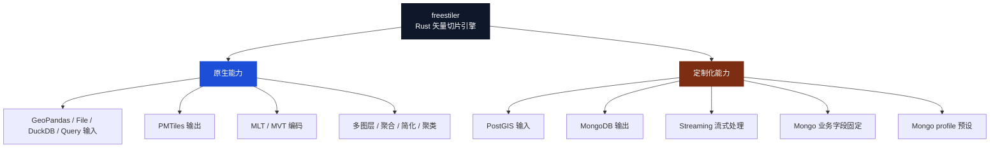

### 1.3 当前项目最重要的结论

- 该项目的统一核心是 Rust 切片引擎，不同输入输出只是围绕这个核心做适配。
- 当前交付重点是 `PostGIS -> MongoDB` 这条定制链路。
- 这条链路已经从“可用”演进到“有参数边界、有默认策略、有真实验证结果”的状态。

---

## 2. 总体架构设计

### 2.1 分层架构图

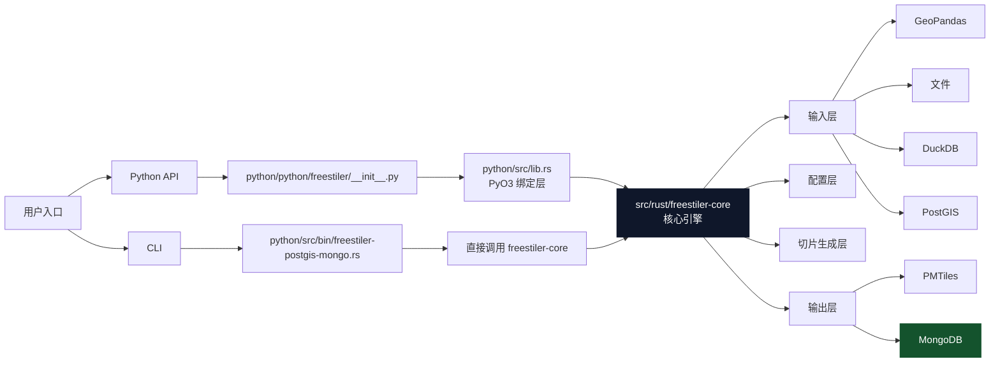

### 2.2 各层职责

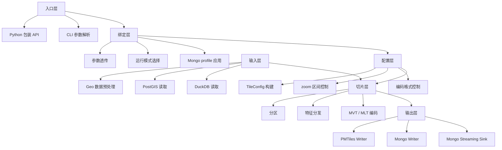

### 2.3 关键文件位置

- Python 入口：[python/python/freestiler/__init__.py](/D:/Code/MyProject/freestiler/python/python/freestiler/__init__.py)
- Python 绑定：[python/src/lib.rs](/D:/Code/MyProject/freestiler/python/src/lib.rs)
- CLI 入口：[python/src/bin/freestiler-postgis-mongo.rs](/D:/Code/MyProject/freestiler/python/src/bin/freestiler-postgis-mongo.rs)
- 核心引擎：[src/rust/freestiler-core/src/engine.rs](/D:/Code/MyProject/freestiler/src/rust/freestiler-core/src/engine.rs)
- Mongo sink：[src/rust/freestiler-core/src/sink/mongo.rs](/D:/Code/MyProject/freestiler/src/rust/freestiler-core/src/sink/mongo.rs)
- Mongo writer：[src/rust/freestiler-core/src/mongo_writer.rs](/D:/Code/MyProject/freestiler/src/rust/freestiler-core/src/mongo_writer.rs)

---

## 3. 主项目标准处理逻辑

### 3.1 标准数据流

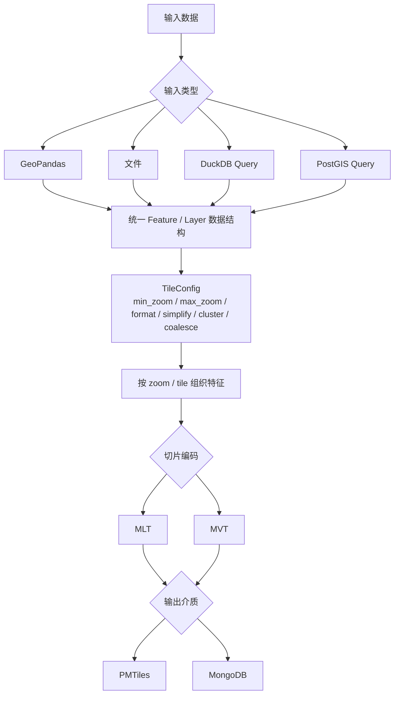

### 3.2 原生主线与定制主线对比

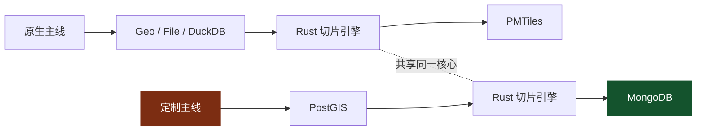

---

## 4. 定制化功能：PostGIS 输入 / Mongo 输出

### 4.1 定制化目标

这部分改造的目标不是简单增加一个数据库输出，而是建立一条适用于大地理表的稳定切片处理链路：

- 从 `PostGIS` 直接读取空间数据
- 尽量避免整表先装入内存
- 在切片阶段保留 `MVT` 编码兼容性
- 输出到 `MongoDB`
- 固定业务文档结构，便于下游系统直接消费

### 4.2 定制化业务总图

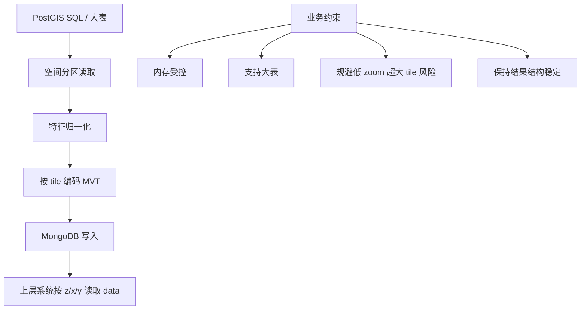

### 4.3 定制链路详细处理流程

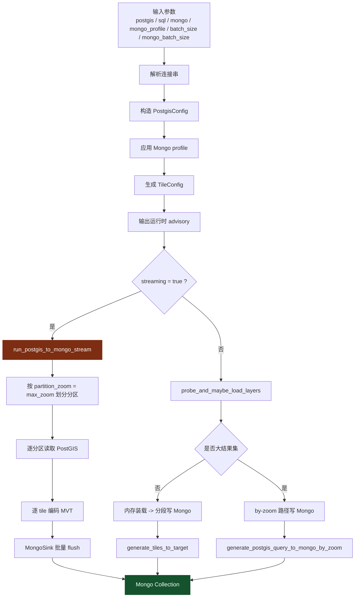

### 4.4 Mongo 文档结构图

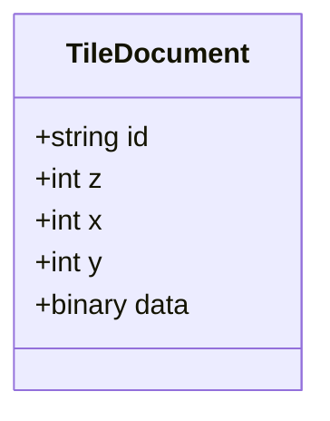

字段语义：

- `id`：业务主键，逻辑上对应 tile 唯一标识
- `z`：缩放层级
- `x`：tile 列号
- `y`：tile 行号
- `data`：切片二进制内容

### 4.5 上层业务使用视角

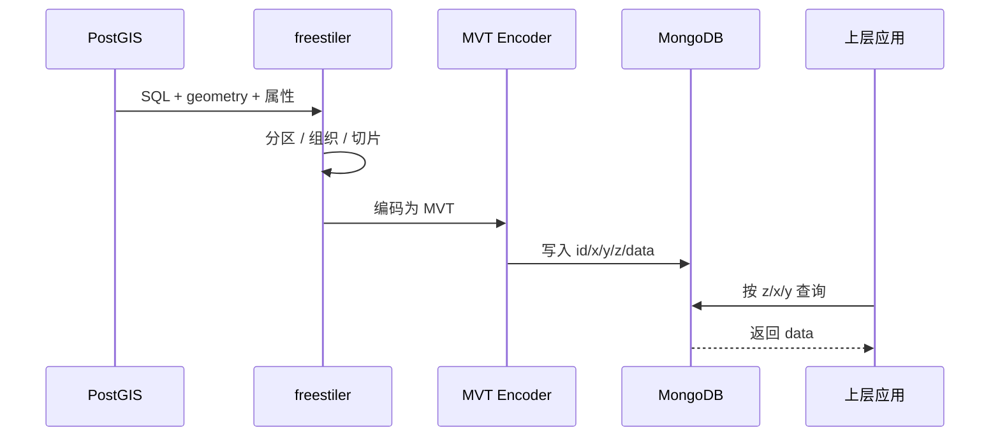

---

## 5. 流式架构设计

### 5.1 为什么必须支持流式

`PostGIS -> MongoDB` 这条链路面对的是大表。  
如果仍然沿用“小数据先全量装载，再统一切片”的方式，会遇到三个问题：

- 单次内存占用过高
- 大表处理不稳定
- 低层级 tile 聚合过大时，Mongo 单文档存在边界风险

所以这里真正合理的结构是：

- 先按空间分区读取
- 边读边切片
- 边切片边写 Mongo

### 5.2 流式核心节点图

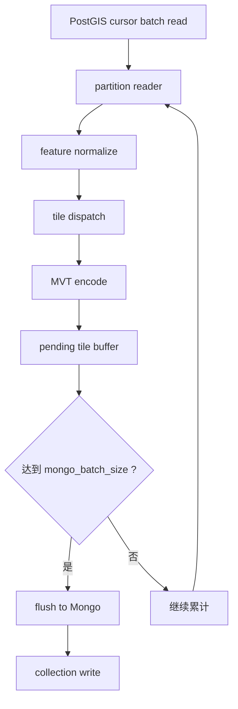

### 5.3 运行模式选择图

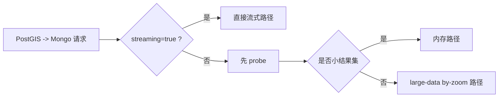

### 5.4 结构判断

从原生架构角度看，这条定制链路适合流式处理。  
真正的硬边界并不在“流式本身”，而在：

- 低 zoom 时单 tile 聚合密度太高
- Mongo 单文档存在 16MB 限制

也就是说，流式能解决“处理过程”的问题，但不能消除“结果载体边界”的问题。

---

## 6. MLT / MVT 与当前定制方案的关系

### 6.1 编码选择图

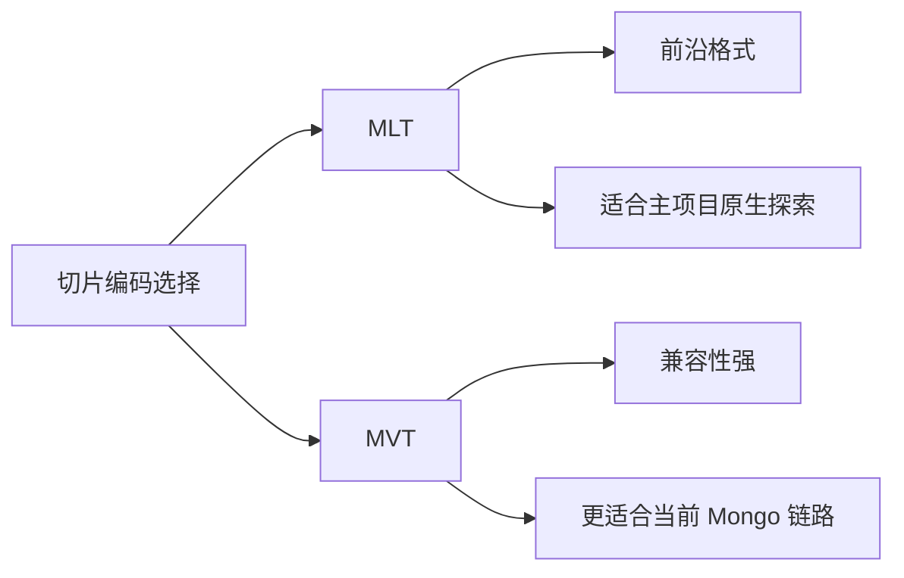

### 6.2 为什么当前 Mongo 主线选择 MVT

对于当前这条定制化业务链路，`MVT` 更合理，原因有三点：

- 与现有读取消费生态兼容性更强
- 当前真实验证和 profile 预设都围绕 `MVT` 固化
- Mongo 输出链路首先追求“稳定可消费”，不是优先追求前沿格式实验

### 6.3 MLT 在当前流式链路中的位置

`MLT` 不是没价值，而是它当前不是这条 Mongo 业务主线的最优默认选择。

更准确地说：

- 主项目保留 `MLT`，说明架构本身对前沿切片格式是开放的
- 但当前定制链路为了生产可落地，默认收敛到 `MVT`

---

## 7. Mongo Profile 与运行边界

### 7.1 Profile 图

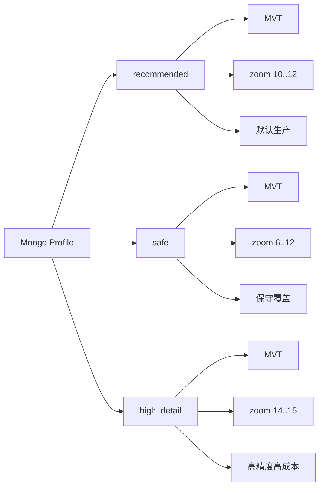

### 7.2 风险边界图

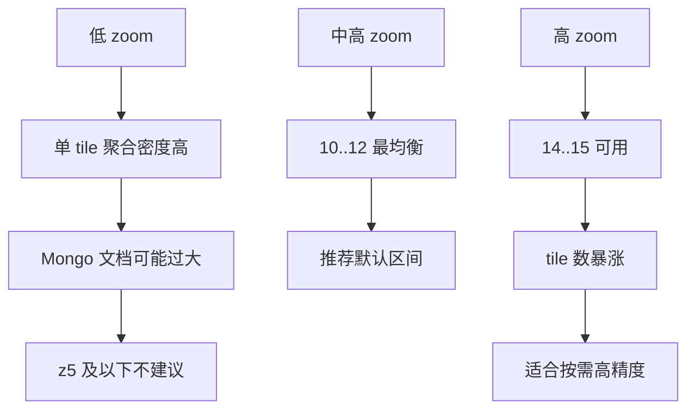

### 7.3 当前建议参数

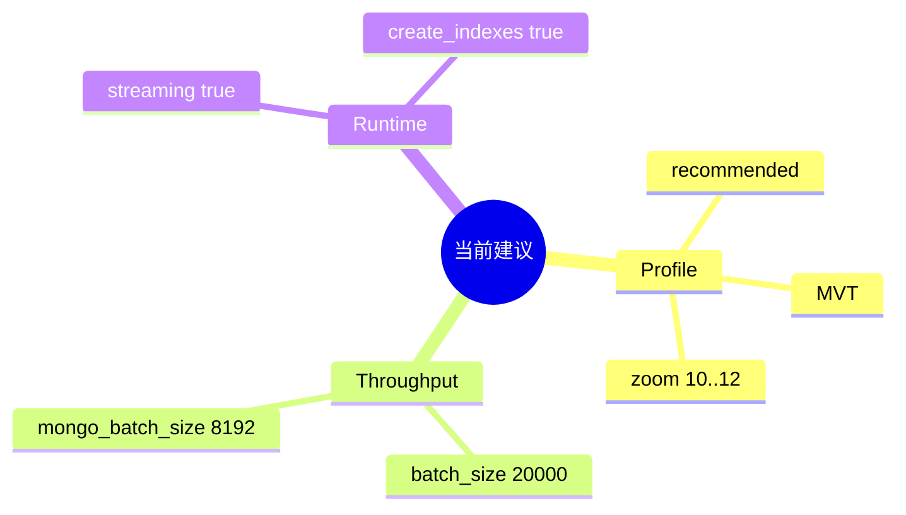

### 7.4 当前边界结论

- 默认生产 profile：`recommended`
- 默认区间：`10..12`
- Mongo 安全下限：`min_zoom >= 6`
- `14..15` 可作为高精度区间
- `z5` 及以下不建议落 Mongo 文档方案

---

## 8. 当前项目现状

### 8.1 当前真实实现状态

- 已具备 `PostGIS -> MongoDB` 流式链路
- Mongo 文档结构已固定为 `id / x / y / z / data`
- Python API 与 CLI 都已支持该链路
- `CLI vs Python API` 已做真实链路一致性验证
- `recommended / safe / high_detail` 三组 profile 已完成验证
- 默认吞吐参数已固定为：
  - `batch_size = 20000`
  - `mongo_batch_size = 8192`

### 8.2 当前最重要的项目结论图

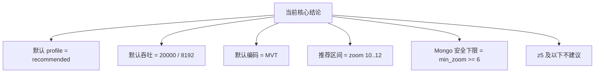

### 8.3 适合汇报时直接使用的结论

- 主项目是一个统一矢量切片架构，而不是单一格式转换工具。
- 当前定制化功能的核心，是把 `PostGIS -> MongoDB` 做成真正适合大表的稳定链路。
- 这条链路的关键不是“能否写 Mongo”，而是“如何在大表下稳定处理，同时规避低 zoom 大 tile 风险”。
- 因此当前方案最终收敛为：
  - `recommended profile`
  - `MVT`
  - `streaming=true`
  - `batch_size=20000`
  - `mongo_batch_size=8192`
  - 默认生产区间 `10..12`

